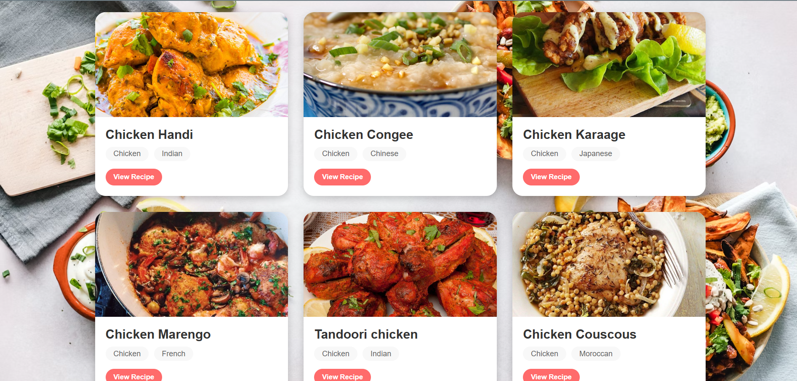

# Food Recipe Website

## Overview
This project is a dynamic Food Recipe Website built using React.js for the frontend and Node.js/Express for the backend. It allows users to search for food recipes using a simple and intuitive interface. The application connects to a recipe API through the backend server to fetch and display detailed recipe information.

## Features
- **Search Functionality**: Users can search for recipes by entering keywords in the search box
- **Responsive Design**: The interface adapts smoothly to different screen sizes
- **Recipe Cards**: Each recipe is displayed in an attractive card format with hover animations
- **Detailed View**: Clicking on a recipe card opens a modal with complete ingredients, instructions, and a YouTube link
- **User Feedback**: Displays "No recipes found" message when search yields no results

## Technologies Used
- **Frontend**: React JS, CSS3, HTML5
- **Backend**: Node.js, Express
- **API**: TheMealDB API for recipe data
- **HTTP Client**: Axios for API requests

## Application Structure
- **Assets**: Contain Screenshots of the Homepage and Recipes
- **Frontend**: Contains React components, styling, and user interface logic
- **Backend**: Express server that handles API requests and data formatting

## Setup and Installation
1. Clone the repository
2. Install **Backend** dependencies and start the server: Open a new Terminal
   ```
   cd backend
   npm init -y
   npm install express axios cors
   node index.js
   ```
3. Install **Frontend** dependencies and start the server: Open a new Terminal
   ```
   cd frontend
   npm start
   ```
4. Access the application at `http://localhost:3000`

## Application Flow
1. User enters a recipe search term and submits
2. Frontend sends request to backend server
3. Backend fetches data from TheMealDB API
4. Backend formats and returns data to frontend
5. Frontend displays recipes as interactive cards
6. User can click on a card to view detailed recipe information

## Future Enhancements
- User accounts for saving favorite recipes
- Recipe rating system
- Filter options (by cuisine, ingredients, cooking time)
- Ability to share recipes on social media
- Nutritional information for recipes

## Screenshots


## Credits
- Recipe data provided by [TheMealDB API](https://www.themealdb.com/api.php)
